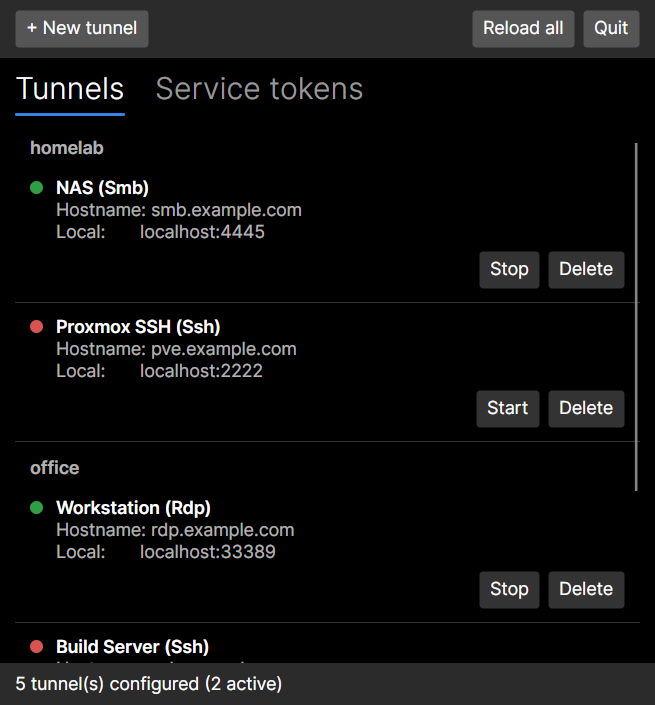

# Cloudflare Tunnel Manager

A small tray app for Linux and Windows that starts and stops [Cloudflare Access](https://developers.cloudflare.com/cloudflare-one/applications/non-http/) TCP tunnels (`cloudflared access tcp`) with one click – for SSH, RDP, SMB or any other TCP service behind Cloudflare. A lightweight alternative to the WARP client when you only need a few TCP tunnels.

- Tunnels are grouped into **profiles** – plain JSON files that are easy to share with colleagues
- Optional **service tokens** for Cloudflare Access; secrets are encrypted at rest with a key from the OS keyring
- Dropped or edited profile files are picked up immediately, changed tunnels are restarted
- Dropped tunnels reconnect automatically with backoff (5 s up to 5 min)
- Tray icon shows the overall state (idle / running / reconnecting); closing the window keeps the tunnels running
- Built with [Avalonia](https://avaloniaui.net/) and published as a **Native AOT** binary – no .NET runtime needed

<p align="center"></p>

## Installation

Download the archive for your platform from the [releases](../../releases) and unpack it.

| Platform | Install | Data directory |
|----------|---------|----------------|
| Linux    | `./install.sh` (`--autostart`, `--uninstall`) – no root required | `~/.config/CloudflareTray` |
| Windows  | Double-click `install.cmd` (`-Autostart`, `-Uninstall`) – no admin rights required | `%APPDATA%\CloudflareTray` |

The `README.txt` in each archive has the details.

> **Windows SmartScreen:** The app is not code-signed, so Windows may show "Windows protected your PC" on first launch. Choose **More info → Run anyway**. To avoid the warning entirely, right-click the downloaded ZIP before unpacking, open **Properties** and tick **Unblock**.

### Requirements

- **cloudflared 2026.9.3 or newer** in the `PATH`
  - Linux: from [pkg.cloudflare.com](https://pkg.cloudflare.com)
  - Windows: `winget install --id Cloudflare.cloudflared`
- **Linux:** `secret-tool` (package `libsecret` / `libsecret-tools`) and a keyring such as GNOME Keyring or KWallet
- **GNOME:** the *AppIndicator and KStatusNotifierItem Support* extension for the tray icon. Without it the app still works, but closing the window only minimizes it.

## Profiles

Profiles live in `profiles/` inside the data directory. A profile `company` consists of two files:

**`company.config.json`**

```json
{
  "Tunnels": [
    {
      "Name": "Server",
      "Hostname": "ssh.example.com",
      "Protocol": "Ssh",
      "LocalAddress": "localhost:2222",
      "Credential": "tray-staff"
    }
  ]
}
```

`Protocol` is one of `Tcp`, `Ssh`, `Rdp`, `Smb`. `Credential` is optional and refers to a service token in the credentials file.

**`company.credentials.json`** (optional)

```json
{
  "Credentials": {
    "tray-staff": {
      "ClientId": "….access",
      "ClientSecret": "…"
    }
  }
}
```

You can hand out a credentials file with a plain-text secret – the app encrypts it on first load and rewrites the file. Encrypted secrets are bound to the machine's keyring and cannot be copied to another computer.

Tunnels and service tokens can also be created and edited in the app itself. All files are written atomically (via a `.tmp` file), so a crash never leaves a half-written profile behind.

## Logs

One log file per day in `logs/` inside the data directory, kept for 14 days.

## Development

Requires the [.NET 10 SDK](https://dotnet.microsoft.com/download).

```bash
dotnet run --project src/CloudflareTray
dotnet test
```

Native AOT publish (needs `clang` on Linux, Visual Studio C++ build tools on Windows; only for the OS you are on):

```bash
dotnet publish src/CloudflareTray -c Release -r linux-x64
```

Icons are generated from `src/CloudflareTray/Assets/portal.svg` with `tools/generate-icons.sh` (requires ImageMagick with librsvg).

### Releases

GitHub Actions (`.github/workflows/build.yml`) runs the tests on every push and pull request and builds the Linux and Windows archives on native runners. Pushing a tag `v*` (e.g. `v0.1.0`) attaches the archives to a GitHub release. The version comes from `<Version>` in `src/CloudflareTray/CloudflareTray.csproj`.

### Project layout

```
src/CloudflareTray/          the app (Avalonia, MVVM with CommunityToolkit.Mvvm)
  Models/                    profile/tunnel records, TunnelInstance (one cloudflared process)
  Services/                  profile loading, encryption, keyring, cloudflared lookup, tray helpers
  ViewModels/ Views/         UI
tests/CloudflareTray.Tests/  xUnit tests
packaging/                   install scripts and README.txt templates for the archives
tools/                       generate-icons.sh
```
